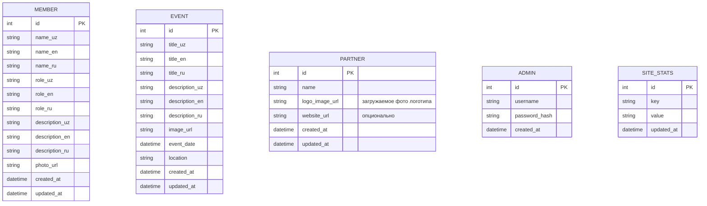

# Nodex — R&D (Research & Development)

**Проект:** Веб-сайт клуба кибербезопасности «Nodex»  
**Школа:** Специализированная школа имени Мухаммеда аль-Хорезми  
**Домен:** nodex.uz  
**Дата:** 19.03.2026

### Что улучшаем

- **Кибер-стилистика:** глитч-эффекты, неоновые акценты, тёмные/светлые паттерны
- **Динамика данных:** все секции (members, events, partners) из БД через API
- **Админ-панель:** полноценный CRUD для управления контентом
- **3 языка** вместо 2

---

## 2. Архитектура проекта

### Монорепо (Turborepo + pnpm)

```
nodex/
├── apps/
│   ├── web/                 # Next.js 14 (App Router) — Frontend
│   │   ├── app/
│   │   │   ├── [locale]/    # i18n routing (uz, en, ru)
│   │   │   │   ├── page.tsx           # Главная (Landing)
│   │   │   │   ├── about/page.tsx     # О нас (опционально отдельная)
│   │   │   │   ├── team/page.tsx      # Команда
│   │   │   │   ├── events/page.tsx    # CTF/Мероприятия
│   │   │   │   ├── partners/page.tsx  # Партнёры
│   │   │   │   └── contact/page.tsx   # Контакты
│   │   │   ├── admin/                 # Админ-панель (SPA)
│   │   │   │   ├── login/page.tsx
│   │   │   │   ├── dashboard/page.tsx
│   │   │   │   ├── members/page.tsx
│   │   │   │   ├── events/page.tsx
│   │   │   │   └── partners/page.tsx
│   │   │   └── layout.tsx
│   │   ├── components/      # UI-компоненты
│   │   ├── lib/             # Утилиты, API-клиент
│   │   ├── messages/        # i18n JSON файлы
│   │   │   ├── uz.json
│   │   │   ├── en.json
│   │   │   └── ru.json
│   │   └── public/          # Статика
│   │
│   └── api/                 # Nest.js — Backend (REST API)
│       ├── src/
│       │   ├── modules/
│       │   │   ├── auth/        # JWT авторизация (админ)
│       │   │   ├── members/     # CRUD членов команды
│       │   │   ├── events/      # CRUD CTF/мероприятий
│       │   │   ├── partners/    # CRUD партнёров
│       │   │   └── upload/      # Загрузка файлов (фото)
│       │   ├── common/          # Guards, interceptors, pipes
│       │   └── config/          # Конфигурация БД, env
│       └── prisma/
│           └── schema.prisma    # Схема БД
│
├── packages/
│   └── shared/              # Общие типы, константы
│       └── types/
│
├── turbo.json
├── pnpm-workspace.yaml
└── package.json
```

### Почему эта архитектура

| Решение | Почему |
|---------|--------|
| **Turborepo** | Быстрый билд, кэширование, единый dev-скрипт |
| **pnpm** | Быстрее npm, строгий node_modules, workspace support |
| **Next.js App Router** | SSR/SSG для SEO, Server Components, middleware для i18n |
| **Nest.js** | Модульная архитектура, декораторы, TypeScript нативно |
| **next-intl** | Лучшее i18n для App Router, type-safe, простое API |
| **Prisma** | Type-safe ORM, миграции, GUI (Prisma Studio) |
| **PostgreSQL** | Надёжная, бесплатная СУБД, отлично работает с Prisma |

### Принципы SOLID в проекте

Проект следует принципам **SOLID** для чистого, расширяемого кода:

| Принцип | Frontend (React/Next.js) | Backend (Nest.js) |
|---------|--------------------------|-------------------|
| **S — Single Responsibility** | Каждый компонент = одна секция (`Hero.tsx`, `About.tsx`, `Team.tsx`). Логика API — в `lib/api.ts`, анимации — в отдельных компонентах (`MatrixRain.tsx`, `CountUp.tsx`) | Каждый модуль = одна сущность (`MembersModule`, `EventsModule`). Service ≠ Controller. `PrismaService` только для БД |
| **O — Open/Closed** | Компоненты принимают данные через `props` — можно менять поведение без изменения кода компонента. CSS Modules изолируют стили | Nest.js модули расширяются через DI (dependency injection) без модификации существующих. Guards и Interceptors — плагируемые |
| **L — Liskov Substitution** | Компоненты с одинаковыми props-интерфейсами взаимозаменяемы (любой `Section` можно заменить другим) | Сервисы реализуют общий паттерн CRUD — можно заменить реализацию не ломая контроллер |
| **I — Interface Segregation** | TypeScript-интерфейсы разделены: `Member`, `Event`, `Partner`, `Stats` — каждый содержит только нужные поля. Компоненты запрашивают только те props, которые используют | Каждый контроллер имеет свой набор endpoints. DTO валидируют только нужные поля |
| **D — Dependency Inversion** | `page.tsx` (Server Component) получает данные через `lib/api.ts` и передаёт в компоненты — компоненты не зависят от конкретного API. Можно подменить источник данных | Nest.js DI-контейнер управляет зависимостями. `PrismaService` инжектируется через конструктор — можно заменить на любой другой ORM |

> [!TIP]
> **Практический итог:** код легко тестировать, расширять (добавлять новые секции/модули) и поддерживать. Каждый файл решает одну задачу, зависимости инвертированы через DI (backend) и props (frontend).

---

## 3. Tech Stack (полный)

### Frontend (apps/web)

| Технология | Версия | Назначение |
|-----------|--------|------------|
| Next.js | 14.x | Framework (App Router, SSR, SSG) |
| React | 18.x | UI library |
| TypeScript | 5.x | Типизация |
| next-intl | latest | i18n (uz, en, ru) |
| Framer Motion | latest | Анимации (glitch, fade-in, parallax) |
| Swiper | latest | Карусели (Team, Events) |

### Backend (apps/api)

| Технология | Версия | Назначение |
|-----------|--------|------------|
| Nest.js | 10.x | REST API framework |
| Prisma | 5.x | ORM |
| PostgreSQL | 16.x | База данных |
| express-session + bcrypt | latest | Сессионная авторизация админа (cookie) |
| Multer | latest | Загрузка файлов |
| class-validator | latest | Валидация DTO |

### DevOps / Инфраструменты

| Технология | Назначение |
|-----------|------------|
| Turborepo | Монорепо orchestration |
| pnpm | Пакетный менеджер |
| ESLint + Prettier | Линтинг и форматирование |
| Docker + docker-compose | Контейнеризация (prod) |

---

## 4. Схема базы данных



> [!NOTE]
> Каждая контентная сущность (Member, Event) имеет поля для 3 языков (`_uz`, `_en`, `_ru`). Это простейший подход для фиксированного количества языков. При необходимости позже можно мигрировать на JSON-поля или таблицу переводов.

---

## 5. Секции лендинга (детальный план)

### 5.1 Header (Sticky)
- Логотип Nodex (слева)
- Навигация: Bosh sahifa, Biz haqimizda, Jamoa, CTF, Hamkorlar, Aloqa
- Переключатель языка: UZ | EN | RU (dropdown или кнопки)
- CTA кнопка: «Telegram kanalga qo'shilish»
- Бургер-меню на мобильных

### 5.2 Hero Section
- Большой заголовок: «Nodex — Kiberxavfsizlik klubi»
- Подзаголовок с миссией
- 2 кнопки: «Batafsil» (скролл к About) + «Telegram» (внешняя ссылка)
- Фоновая кибер-анимация (matrix rain / частицы / grid-pulse)
- Статистика-счётчики (анимация count-up): 20+ a'zolar, 1+ CTF, 2+ hamkorlar

### 5.3 About / О нас
- Текстовый блок: цель клуба, для кого, почему стоит присоединиться
- 3–4 карточки-преимущества с иконками:
  - Bepul darslar (бесплатные уроки)
  - Amaliy mashg'ulotlar (практические занятия)
  - CTF musobaqalar (CTF-соревнования)
  - Mutaxassislar bilan masterklasslar (мастер-классы)

### 5.4 Team / Команда
- Grid или карусель карточек (данные из БД)
- Каждая карточка: фото, имя, должность, краткое описание
- Hover-эффект: подсветка или подъём карточки

### 5.5 CTF Events / Мероприятия
- Карточки мероприятий с описанием (данные из БД)
- Каждая карточка: изображение, название, дата, описание, место проведения
- Кнопка «Batafsil ko'rish» → модал или якорь

### 5.6 Partners / Партнёры
- Grid логотипов (данные из БД)
- Автоматическая карусель при большом количестве
- При hover — название партнёра

### 5.7 Contact / Контакты
- CTA-блок с призывом связаться через Telegram
- Кнопка-ссылка на бота `@nodexccbot` (t.me/nodexccbot)
- Дополнительно: ссылка на Telegram-канал клуба

### 5.8 Footer
- Логотип + краткое описание
- Ссылки: Telegram, соцсети
- Переключатель языка
- Copyright

---

## 7. i18n Стратегия

### next-intl

```
messages/
├── uz.json    # Основной язык (узбекский латиница)
├── en.json    # Английский
└── ru.json    # Русский
```

- **Маршрутизация:** `/uz/...`, `/en/...`, `/ru/...` (prefix-based)
- **Дефолтный locale:** `uz` (с редиректом `/` → `/uz`)
- **Middleware:** автоматическое определение языка из Accept-Language header
- **Переключатель языка:** в header, сохраняет текущий путь

### Контент из БД

Для динамического контента (members, events) — отдельные поля для каждого языка в БД (`name_uz`, `name_en`, `name_ru`). API возвращает все поля, фронтенд отображает нужное на основе текущего locale.

---

## 8. Админ-панель

### Функционал

| Раздел | Действия |
|--------|----------|
| Dashboard | Статистика: кол-во членов, CTF, партнёров |
| Members | CRUD: добавить/редактировать/удалить |
| Events | CRUD: изображение, описание, дата, место |
| Partners | CRUD: логотип (upload), название, URL |

### Авторизация
- Простая сессионная авторизация (httpOnly cookie)
- Пользователь заходит на `/admin` → видит форму входа (логин + пароль)
- После успешного входа — сессия сохраняется в cookie
- Аккаунты создаются заранее через seed-скрипт (CLI)
- Защита роутов: NestJS Guard проверяет cookie, Next.js middleware редиректит на `/admin/login`

> [!NOTE]
> Сложные интеграции с JWT access/refresh токенами не нужны. Простая сессия на cookie достаточна, т.к. админка используется ограниченным числом людей.

### UI
- Простой, функциональный дизайн (без кибер-стилистики)
- Таблицы + формы + модалы
- Drag-and-drop для сортировки (sort_order)

---

## 9. SEO

| Аспект | Реализация |
|--------|------------|
| SSR/SSG | Публичные страницы рендерятся на сервере |
| Meta tags | Динамический `<title>`, `description`, og:image для каждого locale |
| Sitemap | Автогенерация `/sitemap.xml` (Next.js metadata API) |
| robots.txt | Разрешить индексацию публичных страниц, запретить /admin |
| Structured Data | Organization schema (JSON-LD) |
| Performance | Image optimization (next/image), lazy loading |
| hreflang | Указание альтернативных языковых версий |

---

## 10. Telegram — простая ссылка

- В секции **Contact** и в **Header** размещаем кнопку-ссылку на `t.me/nodexccbot`
- Дополнительно в Footer — ссылка на Telegram-канал клуба
- Никакой серверной интеграции с Telegram не требуется
- Бот `@nodexccbot` обрабатывает обращения самостоятельно

---

## 11. Деплой

### Рекомендуемый стек

| Компонент | Где |
|-----------|-----|
| Frontend (Next.js) | Vercel (бесплатно) или VPS |
| Backend (Nest.js) | VPS (PM2 / Docker) |
| PostgreSQL | VPS (Docker) или Supabase (бесплатно) |
| Домен | nodex.uz (DNS → Vercel / VPS) |
| Файлы (uploads) | VPS local / S3-compatible (MinIO) |

### Альтернатива: всё на VPS

```
VPS (Ubuntu)
├── Docker Compose
│   ├── nginx (reverse proxy + SSL)
│   ├── web (Next.js, port 3000)
│   ├── api (Nest.js, port 4000)
│   └── db (PostgreSQL, port 5432)
└── Certbot (Let's Encrypt SSL)
```

---

## 12. Оценка объёма работ

| Этап | Задачи | Примерный объём |
|------|--------|-----------------|
| 1. Setup | Монорепо, конфиги, базовая структура | ○○○ |
| 2. Backend | Prisma schema, modules, auth, API endpoints | ○○○○ |
| 3. Frontend: Landing | Все секции лендинга + анимации | ○○○○○ |
| 4. i18n | Переводы, routing, language switcher | ○○○ |
| 5. Admin Panel | Dashboard, CRUD, upload | ○○○○ |
| 6. Contact | CTA-секция + ссылка на TG бота | ○ |
| 7. SEO & Polish | Meta, sitemap, performance, responsive | ○○○ |
| 8. Deploy | Docker, nginx, SSL, domain | ○○ |

---

## 13. Риски и решения

| Риск | Решение |
|------|---------|
| Нет дизайн-макета (Figma) | Создаём на основе референса + кибер-стилистика |
| Нет контента (тексты, фото) | Используем placeholder-контент, легко заменяемый через админку |
| Домен nodex.uz | Убедиться что DNS настроен и доступен |

> [!IMPORTANT]
> Перед началом разработки необходимо уточнить:
> 1. Логотип Nodex (если есть готовый — предоставить, иначе сделаем)
> 2. Фото членов команды и описания
> 3. Логотипы и названия партнёров
> 4. Хостинг — Vercel + VPS или полностью VPS?
